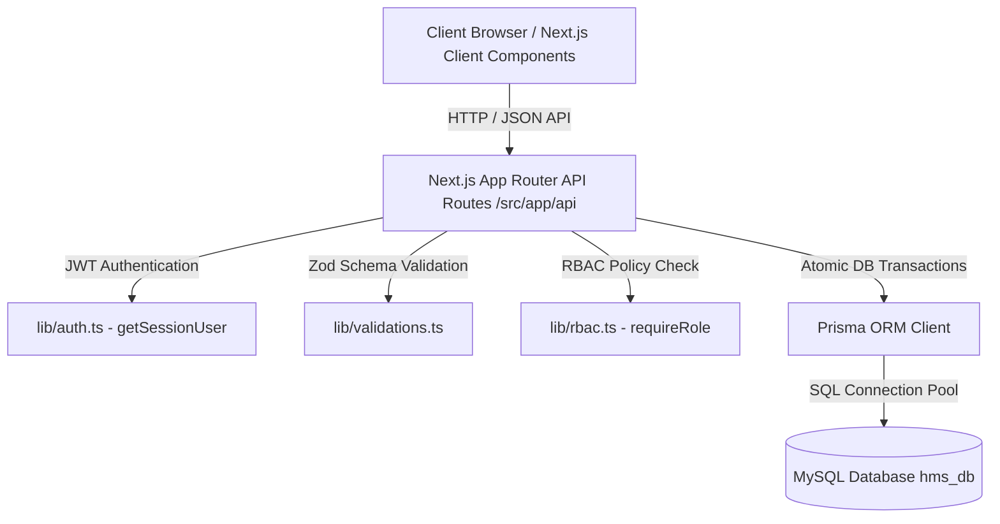

# Hospital Management System (HMS) — System Architecture Document

## 1. System Overview
The **Hospital Management System (HMS)** is an integrated, multi-role web platform designed for healthcare facility administration, clinical workflows, patient portals, pharmacy inventory management, financial invoicing, and administrative analytics.

- **Academic Context**: B.Tech CSE 5th Semester • Software Engineering Laboratory Project (Practicals 1–6)
- **Framework**: Next.js 16 (App Router)
- **Language**: TypeScript 5.x
- **Database**: MySQL (`hms_db`) via Prisma ORM 5.22
- **Authentication**: JWT Cookie Sessions (`jose`)
- **Styling**: Tailwind CSS & Vanilla HSL design tokens

---

## 2. Architectural Layers



### Layer Breakdown
1. **Presentation Layer**: Client Components (`use client`) built with Tailwind CSS, Lucide icons, responsive layouts, interactive modals, and real-time state management.
2. **API & Business Logic Layer**: Next.js Server Route Handlers (`/api/...`) handling request parsing, parameter sanitization, business logic execution, atomic database transactions (`$transaction`), and audit logging.
3. **Security & Authentication Layer**: Stateless HTTP Cookie-based JWT authentication (`jose`) with server-side identity verification (`getSessionUser`). Role-Based Access Control (RBAC) enforced server-side.
4. **Data Access Layer**: Prisma ORM with type-safe schema definitions, relational constraints, foreign keys, cascades, and explicit indexes.
5. **Persistence Layer**: Relational MySQL database (`hms_db`) running locally.

---

## 3. Core Modules & Flow Diagrams

### 3.1 Authentication & Authorization Flow
```
User Login Request (Email + Password)
  ↓
/api/auth/login
  ↓
Fetch User record from MySQL via Prisma
  ↓
Verify password hash (bcryptjs)
  ↓
Sign JWT token payload (ID, Email, Role, PatientProfileID / DoctorProfileID)
  ↓
Set HTTP-only secure cookie ('hms_token')
  ↓
Return User Session Payload to Client
```

### 3.2 Appointment Booking & Double-Booking Protection
```
Patient selects Doctor, Date & Time Slot
  ↓
POST /api/appointments
  ↓
Validate target date >= today
  ↓
Execute Prisma $transaction:
  1. Re-verify doctor working day schedule
  2. Check existing appointment conflict (doctorId + date + timeSlot + active status)
  3. Create Appointment (CONFIRMED)
  4. Auto-generate consultation fee Bill (UNPAID)
  5. Create DB Notification for patient
  6. Insert AuditLog entry
  ↓
Commit Transaction & Return Confirmation
```

### 3.3 Pharmacy Inventory & Order Concurrency
```
Patient places Medicine Order (Items + Quantities)
  ↓
POST /api/orders
  ↓
Execute Prisma $transaction:
  1. Verify medicine stock >= requested quantity for each item
  2. Create MedicineOrder (PENDING)
  3. Create OrderItems linked to Medicine
  4. Auto-generate pharmacy Bill (UNPAID) with 5% tax
  5. Atomically decrement stock in Medicine table
  6. Insert AuditLog entry
  ↓
Commit Transaction & Return Order Payload
```

### 3.4 Safe DEMO Payment Processing
```
Patient initiates Demo Payment (UPI / Card / Wallet)
  ↓
POST /api/payments
  ↓
Re-fetch Bill & verify amount == bill.grandTotal (Server-side price authority)
  ↓
Execute Prisma $transaction:
  1. Create Payment record (status: SUCCESS, transactionId: TXN-DEMO-XXXXXX)
  2. Update Bill.paymentStatus = PAID
  3. If linked to order, update MedicineOrder.status = DISPENSED
  4. Create DB Notification for patient
  5. Insert AuditLog entry
  ↓
Commit Transaction & Generate Printable Receipt
```

---

## 4. Academic Disclaimer
*This Hospital Management System is an academic demonstration project. Medical information, prescriptions, payments and records shown in the system are fictional/demo data and should not be used for real medical decisions. Software Engineering Laboratory Project.*
