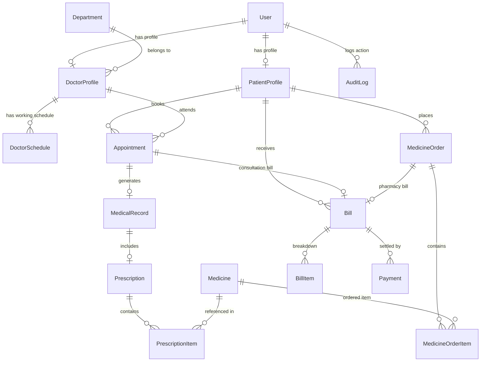

# Hospital Management System (HMS) — Database Schema & Data Dictionary

## 1. Database Overview
- **Database Engine**: MySQL
- **Database Name**: `hms_db`
- **ORM**: Prisma ORM 5.22
- **Schema Location**: `prisma/schema.prisma`
- **Relational Integrity**: Foreign key constraints, CASCADE deletes on child records, explicit indexes on frequently queried fields (`email`, `role`, `date`, `status`, `userId`, `patientId`, `doctorId`).

---

## 2. Entity Relationship Model (ERD Summary)

---

## 3. Data Dictionary (Entities & Fields)

### 3.1 `User`
Primary user account table storing login credentials and role assignments.
- `id` (String, PK, UUID)
- `email` (String, Unique)
- `passwordHash` (String)
- `name` (String)
- `role` (Enum: `ADMIN`, `DOCTOR`, `NURSE`, `RECEPTIONIST`, `PHARMACIST`, `PATIENT`)
- `phone` (String, Optional)
- `createdAt` (DateTime)
- `updatedAt` (DateTime)

### 3.2 `PatientProfile`
Extended medical profile for patient users.
- `id` (String, PK, UUID)
- `userId` (String, FK -> `User.id`, Unique)
- `patientIdCode` (String, Unique, e.g., `PAT-1001`)
- `dateOfBirth` (DateTime)
- `gender` (String)
- `bloodGroup` (String, Optional)
- `address` (String, Optional)
- `medicalHistory` (Text, Optional)

### 3.3 `DoctorProfile`
Extended clinical profile for doctor users.
- `id` (String, PK, UUID)
- `userId` (String, FK -> `User.id`, Unique)
- `departmentId` (String, FK -> `Department.id`)
- `specialty` (String)
- `consultationFee` (Float)
- `bio` (Text, Optional)
- `rating` (Float, Default: 5.0)
- `availability` (String)

### 3.4 `Department`
Hospital clinical departments.
- `id` (String, PK, UUID)
- `name` (String, Unique)
- `description` (String, Optional)

### 3.5 `DoctorSchedule`
Weekly doctor availability working hours.
- `id` (String, PK, UUID)
- `doctorId` (String, FK -> `DoctorProfile.id`)
- `dayOfWeek` (Int, 0=Sun to 6=Sat)
- `startTime` (String, e.g., `09:00`)
- `endTime` (String, e.g., `17:00`)
- `slotDurationMinutes` (Int, Default: 30)
- `isAvailable` (Boolean, Default: true)

### 3.6 `Appointment`
Clinical appointment bookings.
- `id` (String, PK, UUID)
- `appointmentNo` (String, Unique, e.g., `APT-1001`)
- `patientId` (String, FK -> `PatientProfile.id`)
- `doctorId` (String, FK -> `DoctorProfile.id`)
- `date` (DateTime)
- `timeSlot` (String, e.g., `10:30 AM`)
- `reason` (String, Optional)
- `symptoms` (Text, Optional)
- `status` (Enum: `PENDING`, `CONFIRMED`, `COMPLETED`, `CANCELLED`)
- `createdAt` (DateTime)
- `updatedAt` (DateTime)

### 3.7 `MedicalRecord`
Electronic Health Record (EHR) created by doctors.
- `id` (String, PK, UUID)
- `appointmentId` (String, FK -> `Appointment.id`, Unique, Optional)
- `patientId` (String, FK -> `PatientProfile.id`)
- `doctorId` (String, FK -> `DoctorProfile.id`)
- `diagnosis` (Text)
- `treatment` (Text)
- `labResults` (Text, Optional)
- `createdAt` (DateTime)
- `updatedAt` (DateTime)

### 3.8 `Prescription` & `PrescriptionItem`
Digital doctor prescriptions and prescribed medications.
- `Prescription`: `id`, `medicalRecordId`, `patientId`, `doctorId`, `notes`
- `PrescriptionItem`: `id`, `prescriptionId`, `medicineId`, `dosage`, `quantity`

### 3.9 `Medicine`
Pharmacy inventory catalog.
- `id` (String, PK, UUID)
- `name` (String)
- `description` (Text, Optional)
- `category` (String)
- `price` (Float)
- `stock` (Int)
- `expiryDate` (DateTime)
- `supplier` (String)

### 3.10 `MedicineOrder` & `MedicineOrderItem`
Patient online medicine store orders.
- `MedicineOrder`: `id`, `orderNo`, `patientId`, `totalAmount`, `status` (`PENDING`, `PROCESSING`, `DISPENSED`, `CANCELLED`)
- `MedicineOrderItem`: `id`, `orderId`, `medicineId`, `quantity`, `price`

### 3.11 `Bill` & `BillItem`
Financial invoicing for consultations and pharmacy sales.
- `Bill`: `id`, `billNo`, `patientId`, `appointmentId`, `orderId`, `subtotal`, `discount`, `tax`, `grandTotal`, `paymentStatus` (`UNPAID`, `PAID`, `REFUNDED`)
- `BillItem`: `id`, `billId`, `description`, `amount`

### 3.12 `Payment`
Safe simulated DEMO transactions.
- `id` (String, PK, UUID)
- `transactionId` (String, Unique, e.g., `TXN-DEMO-UPI-100001`)
- `billId` (String, FK -> `Bill.id`)
- `amount` (Float)
- `method` (Enum: `UPI`, `CARD`, `WALLET`, `CASH`)
- `status` (String, Default: `SUCCESS`)

### 3.13 `Notification` & `AuditLog`
System notification alerts and administrative audit logging.
- `Notification`: `id`, `userId`, `title`, `message`, `isRead`, `createdAt`
- `AuditLog`: `id`, `userId`, `action`, `details`, `createdAt`

---

## 4. Academic Disclaimer
*This Hospital Management System is an academic demonstration project. Medical information, prescriptions, payments and records shown in the system are fictional/demo data and should not be used for real medical decisions. Software Engineering Laboratory Project.*
